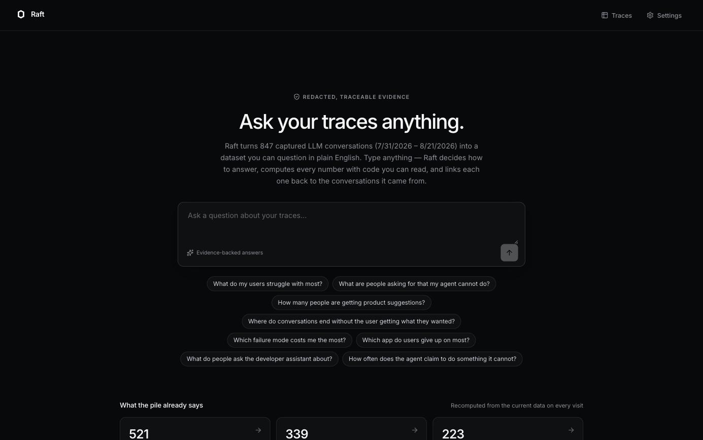
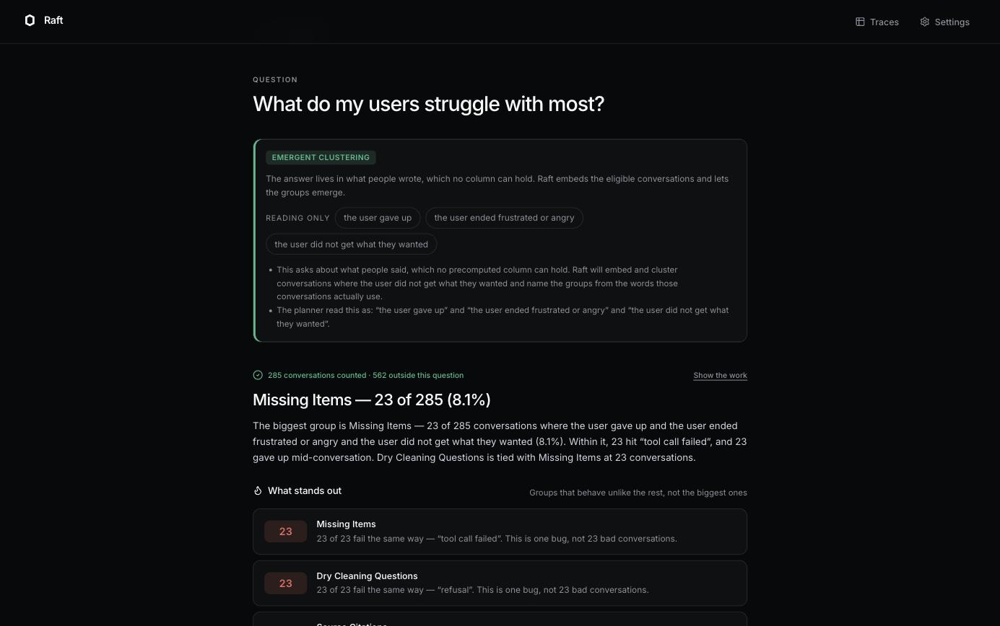
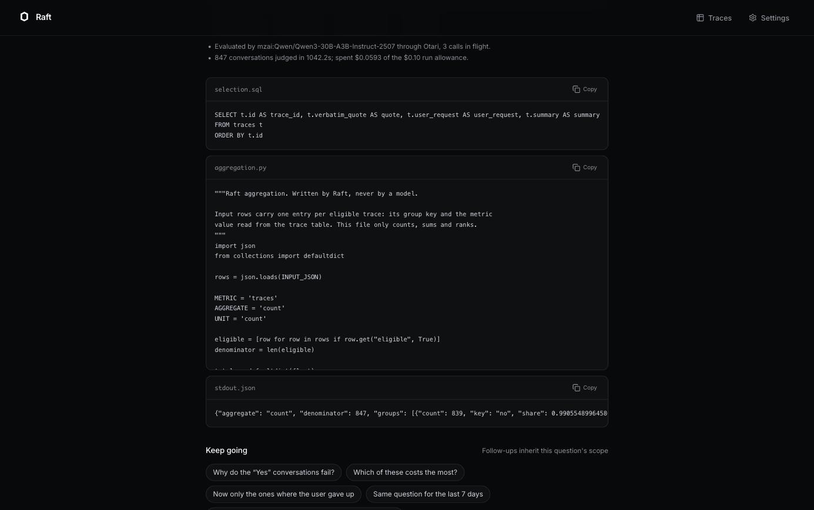
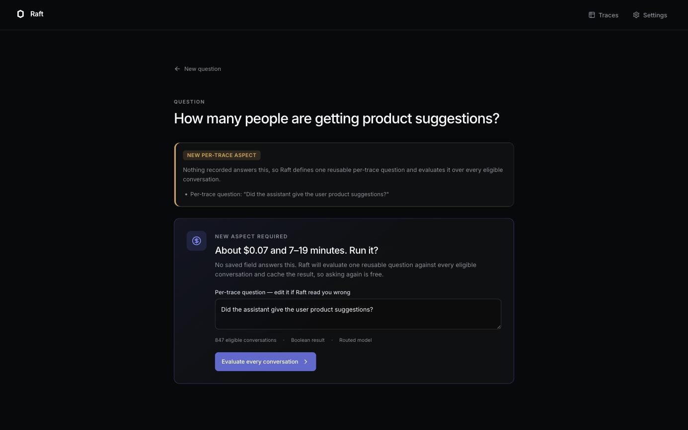
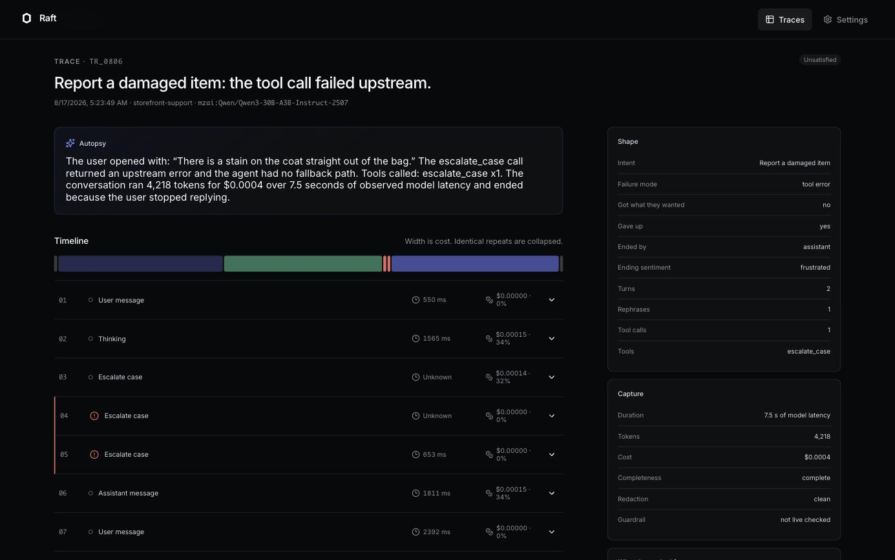
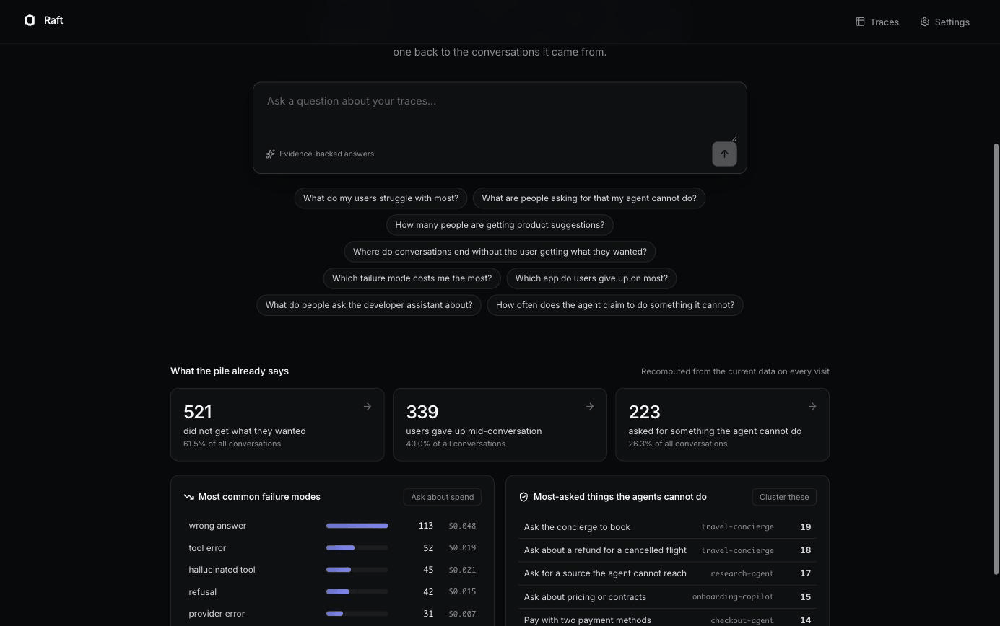

# Raft

Raft turns a pile of LLM traces into a queryable research dataset. You type a
question in plain English, Raft decides how to answer it, computes every number
with code you can read, and links each number back to the conversations it came
from.

Nothing is precomputed for a fixed list of questions. Type something nobody
anticipated and it still gets answered.

**Try it:** https://raft-production.up.railway.app — no signup; the demo
workspace of 847 redacted conversations is already there. Start with one of the
example questions on the Home page, then type your own. The Otari integration
log with every observed request, error and measurement is in
[`otari-log.md`](otari-log.md).

## Run it

```sh
cp .env.example .env
docker compose up --build
```

Open [http://localhost:8010](http://localhost:8010). No signup, no keys, no
configuration: the demo workspace generates itself on first boot and Home is
populated in about a second.

### Upgrading an existing install

```sh
docker compose up --build
```

The `raft-data` volume survives rebuilds on purpose, so the demo dataset is not
regenerated on every restart. When the generator changes, a stored corpus
version marker no longer matches and the dataset is rebuilt automatically —
watch for `[raft] demo dataset rebuilt (...)` on startup. To force it, either
regenerate from Settings or `docker compose down -v`.

This matters because the failure mode is silent: rows built by an older
generator keep their old text and get schema defaults for any column added
since, so every content filter matches nothing and every question returns the
same answer.

For development:

```sh
python -m venv .venv && source .venv/bin/activate
pip install -e '.[dev]'
uvicorn raft.main:app --reload --port 8010

cd web && npm install && npm run dev
```

## What it looks like













## How a question gets answered

Raft compiles your question into a typed query - a metric, a grouping, a set of
filters, and whatever meaning is left over - and routes it down one of three
paths. The Answer page always shows which path it took and why.

| Your question | Path | What actually happens |
| --- | --- | --- |
| "Which failure mode costs me the most?" | **Recorded shape** | Filters and grouping become parameterised SQL over recorded columns, then one fixed Python aggregation. |
| "What do my users struggle with most?" | **Emergent clustering** | Conversations are grouped by mutual nearest neighbours over what each person asked and which tools ran, then each group is named — by the routed cluster-namer model in live mode, or after the request its most typical member actually made when no model is configured. No taxonomy is shipped, and the names never change the counts. |
| "How many people are getting product suggestions?" | **New aspect** | Raft writes one reusable per-trace question, asks your approval, evaluates it against every eligible conversation, and caches the result. |

The compiler reads more than keywords. `"how much did the billing bot cost me"`
becomes `sum(cost) where app = billing-bot`. `"which model is slowest"` becomes
`avg(duration) grouped by model` - average, not total, because ranking by total
latency just ranks by traffic. `"in the last 7 days"` becomes a bound
parameter. Words it cannot map survive as the semantic focus and change the
route rather than being dropped.

Follow-ups inherit scope. Ask "which app do users give up on most", then "now
only the checkout agent", and the give-up filter carries forward while the app
filter is replaced.

## What is guaranteed

- **Every number is executed code.** "Show the work" shows the exact SQL with
  its bound parameters, the exact Python that ran, and its raw stdout. No model
  ever counts, and no model writes the aggregation.
- **Every quote is a literal substring** of a stored redacted span, verified in
  code and dropped if it fails. Never a paraphrase.
- **Every answer drills down** to exactly the traces that were counted -
  `len(trace_ids) == count`, asserted in the test suite.
- **PII never reaches a model or the screen.** Deterministic local redaction
  runs at ingest; the original is never what gets analysed.
- **Unknown stays unknown.** A base-URL proxy sees LLM latency, not the
  application's own tool duration, so tool timing is shown as unknown rather
  than inferred from message order.
- **The answer leads with what is disproportionate**, not what is biggest —
  a group where 17 of 17 conversations fail identically is a finding; the
  largest group usually just means that app is popular.
- **Every group says what happened to it** — how many gave up, which failure
  they kept hitting, which app they were in, what they cost — read back from
  the same rows that were counted.

### When Raft cannot pin your question down

A question only narrows the data if its words appear in the conversations.
Nobody writes "I am complaining" in a support chat — they write *"this is going
in circles"* — so "what do customers complain about?" matches nothing lexically.

Raft never pretends otherwise. A question it cannot tie to the data returns a
clearly-labelled **overview** of the whole dataset, plus suggested questions
built from wording the conversations really contain, each one click away from a
specific answer. Silently grouping the entire dataset and presenting it as a
reply is the one thing it will not do — that is how every question ends up
looking like the same answer.

With a model planner configured, this mostly stops happening: the model
translates "complain" into recorded filters like *the user ended frustrated*.
It picks filters by id from a menu Raft supplies and Raft validates every one,
so the interpretation is the model's and the query stays Raft's — it never
writes SQL and never returns a number.

### Why the groups are trustworthy

Grouping is the part that is easiest to fake convincingly, so it is measured.
The corpus records which intent produced each conversation, which makes cluster
purity checkable. Flat k-means over these vectors scores ~0.35: it is forced to
produce k groups from a long tail of distinct requests, so it builds grab-bags
held together by whichever common word two sentences shared — and then names the
group after that word ("Puffer vest" for a set of Christmas-return complaints).

Conversations about the same thing are near-duplicates instead, so Raft links
only *mutual* nearest neighbours above a similarity floor and then merges the
resulting small, coherent groups by average linkage. That scores ~0.88, and
`tests/test_analysis.py::test_clusters_are_coherent_not_grab_bags` fails below
0.6. Group names are real sentences pulled from the group's own traces, which a
test also enforces — so a label can always be checked by opening the trace.

## Modes

Raft runs fully without any credentials. Settings always states which of these
is producing your answers.

| | No credentials (default) | Live |
| --- | --- | --- |
| Question routing | local compiler | Otari planner; it gains Raft's MCP tools once the server is registered with Otari, which needs the public URL |
| Aggregation | the same Python, in-process | Otari sandbox session when the deployment has one; hosted `api.otari.ai` currently returns 503, so the same Python runs in-process and "Show the work" names which |
| Aspect judgment | `local:semantic-judge-v1` | routed open-weight model |
| Cluster naming | class-based TF-IDF over member wording | routed model |
| Embeddings | corpus-fitted TF-IDF + SVD | same, or `BAAI/bge-small-en-v1.5` with `RAFT_USE_BGE=1` |

Live mode wants Otari (`RAFT_OTARI_MODE=live` plus the role keys in
`.env.example`). Run `python scripts/otari_setup.py --key <key> --base
https://api.otari.ai --deployment hosted` first: it discovers which models the
key can actually reach, and makes one real completion and one real embeddings
call. Do not pass `--write` against hosted Otari: its model-preference list
matches `bedrock:` catalog entries before `mzai:` ones and would replace the
open-weights roles in `model-roles.yaml` with models the key cannot use. Set
`RAFT_OTARI_DEPLOYMENT=hosted` for `api.otari.ai` (management routes live under
`/api/v1`) or `standalone` for a self-hosted gateway (`/v1`, and it mounts
`/v1/embeddings`). Any OpenAI-compatible Chat Completions endpoint also works via
`RAFT_LLM_PROVIDER=openai_compatible` with `RAFT_LLM_BASE_URL` /
`RAFT_LLM_API_KEY` / `RAFT_LLM_MODEL`. Otari-only request fields - guardrails,
`mcp_server_ids`, server-side tools, the sandbox - are simply not sent in that
mode, and Settings says so rather than claiming the feature.

### How good is the local aspect judge?

It is a classifier, not a language model, and the product says so wherever its
output appears. `python scripts/eval_judge.py` measures it against the corpus's
own ground truth:

```
mean F1 0.59 over 10 labelled aspect questions
```

It is strong when a conversation states the thing in its own words (visa
questions F1 1.00, cancellations 0.85, deploy requests 0.81) and weak where the
question and the conversation use different words for the same idea, or where
the difference is negation — "Did the user ask for a refund?" scores 0.14,
partly because "I did not ask for a refund" contains the word too.

That is why every aspect answer ships with a
verification sample of five yes and five no, a plain warning that no model was
involved, and an editable question - a changed question creates a new aspect
version rather than overwriting the old evidence. With a model configured, that
step is a model call instead.

## The demo dataset

Generated by `raft/corpus.py`: eight apps, roughly fifty user intents, and a
compositional template system producing hundreds of distinct openings. Each
conversation is built first - an app with a bounded tool surface, a user asking
for something inside or outside it - and every label is then derived from the
spans that were generated. `turns`, `tool_calls`, `distinct_tools`,
`cost_usd` and the rest are checked against the stored spans in
`tests/test_corpus.py`, so a shape column can never disagree with the trace
beside it.

Regenerate at any size or seed from Settings, or:

```sh
python -c "from raft.db import Database; from raft.demo import build_dataset; \
  from pathlib import Path; db=Database(Path('data/raft.db')); db.initialize(); \
  print(build_dataset(db, count=2000, seed=1))"
```

## Tests

```sh
pytest                     # 112 tests
python scripts/eval_judge.py   # measured aspect-judge accuracy
python scripts/eval_focus.py   # how well a question selects its own subject
```

The suite asserts the product claims, not just the plumbing: routing across 16
phrasings, groups summing to the denominator, quotes being literal substrings,
drill-down exactness, budget pause and resume, aspect versioning, and the PRD's
requirement that the five example questions span all three paths.

## Live Otari gate

1. Configure every role key from `.env.example` and set `RAFT_OTARI_MODE=live`.
2. Provision the workspace-level Routing policies, Guardrails, budgets, MCP
   registration, sandbox, and web search.
3. Run `python scripts/live_smoke.py single-label` before using any downstream
   feature.
4. Run the 40/20 manual gate in `manual-label-review.md`.
5. Run `all-models`, `fallback-drill`, `budget-probe`, `code-execution`,
   `guardrails`, and `web-search` through `scripts/live_smoke.py`.
6. Replace `pending` evidence in `otari-log.md` immediately after each live
   attempt, using only observed request IDs, errors, costs, latency and
   friction.

## Public demo

The public instance runs on Railway from this repository's `Dockerfile`: one
service, a persistent volume mounted at `/data` for the SQLite database, the
role keys as service variables, and `PORT=8000`. The demo corpus generates
itself on the first boot of an empty volume. To reproduce: `railway init`,
`railway volume add -m /data`, set the variables from `.env.example`,
`railway domain --port 8000`, `railway up`.

A self-hosted alternative with a named Cloudflare Tunnel is documented in
`DEPLOYMENT.md`. `tester-script.md` is the five-minute walk-through an outside
tester follows.

## Known limitations, 4 September 2026

- One desktop size: the layout has a 1180px minimum width and no breakpoints, so a
  narrow laptop window scrolls horizontally on the Traces page.
- A new per-trace aspect over 847 conversations takes minutes, not seconds, at
  the 3-in-flight concurrency the hosted gateway tolerates tonight (see
  `otari-log.md`); asking a cached question is instant.
- If the gateway stops answering mid-run, the run pauses with its judged rows
  saved and a Resume button rather than finishing on a different judge. That is
  deliberate; it means a live demo can end on a pause card.
- The demo corpus is generated, and a few generated request sentences have
  grammar slips ("Is the running shoes true to size?") that show when they are
  used as group names.
- An answer does not yet say on its own card whether the Otari planner or the
  local compiler chose its path; Settings records planner calls, but per-answer
  attribution needs a persisted field and is the next change planned.
- Raft's MCP server serves five read-only tools at `/mcp`, but it is not yet
  registered with Otari, so no planner request has carried `mcp_server_ids`.
- No outside tester has walked `tester-script.md` yet; that is scheduled for
  5 September and will be recorded in `otari-log.md`.

## What is deliberately absent

SQLite rather than PostgreSQL/pgvector, NumPy over the vectors rather than a
vector database, in-process background tasks rather than Redis/Dramatiq, one
desktop size, one dark theme. No Alembic, virtualization, mobile breakpoints,
light theme, Playwright suite, or axe suite.
